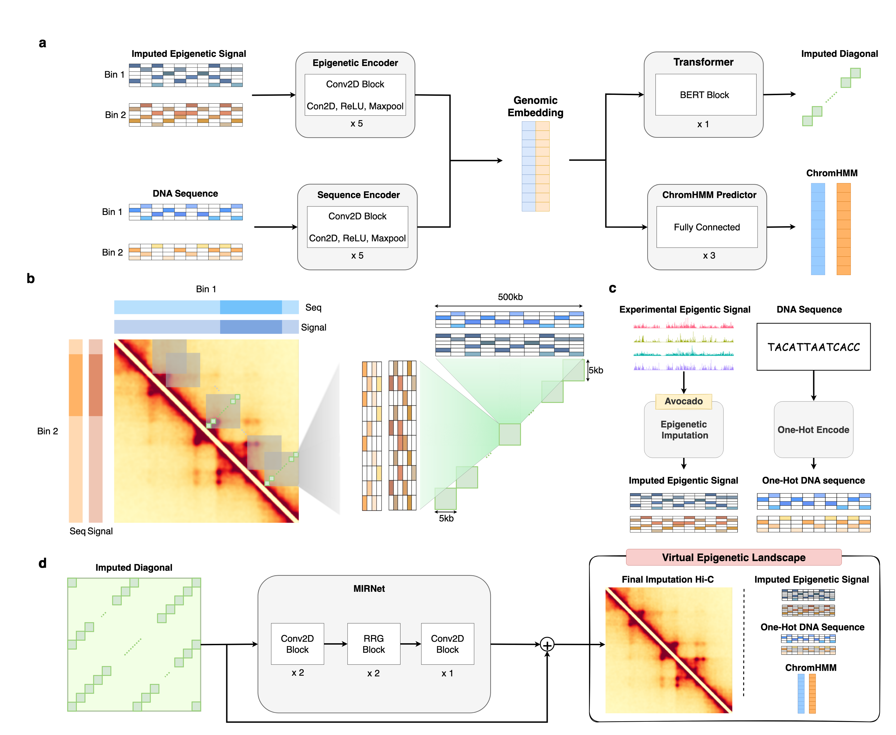

# EpiVerse
Welcome to the official repository of EpiVerse, an innovative three-stage pipeline chromatin strucuture imputation tool. EpiVerse specializes in high-quality, cross cell-type Hi-C imputations, facilitating unique "epigenome-level" perturbational Hi-C experiments. It offers valuable insights into chromatin architecture dynamics across various epigenetic conditions.



## Visualization Browser
Explore imputed Hi-C data effortlessly with our dedicated browser in http:/epiverse.jhhlab.tw, designed for 39 tissues. This intuitive tool simplifies data interpretation, enhancing your research experience.
## Installation
EpiVerse comprises three core modules: Avocado, HiConformer, and MIRNet. Due to conda environment conflicts, we recommend installing EpiVerse across three separate conda environments.
### Avocado Environment
Set up the Avocado environment using:
```
conda create -n Avocado
conda activate Avocado
pip install avocado-epigenome
```
### HiConformer training and MIRNet training Environment
For HiConformer and MIRNet, execute this command:
```
conda env create -f environments/HiConformer.yml
```
### Data processing environment
We utilize fanc to convert the file format and process. 
```
conda env create -f environments/fanc.yml
```
## Avocado
We leverage the [Avocado](https://github.com/jmschrei/avocado) model for new cell type imputations, following its prescribed methodology.

1. Download the pretrained Avocado model weights: Begin by downloading the Avocado pretrained model weights. Use the ENCODE-Core hg38 Version available at [Zenodo](https://zenodo.org/records/4774521)
2. Fit New Celltypes: Utilize Avocado's fitting function with your data (comprising available tracks) to fit new cell types. This is done using the `model.fit_celltypes(data, n_epochs=50)` command, where data represents your available epigenomic tracks.
3. Predict Missing Tracks: Run the prediction function for your specific cell type and the missing tracks using model.predict("{YOUR_CELLTYPE}", "{MISSING_TRACKS}").
4. Integrating Imputations with Available Tracks: Once you have predicted the missing tracks using Avocado, the next step is to integrate these imputed tracks with your existing data. This combined dataset will serve as the input for HiConformer.

**Note1**: If the tissues is inside the Avocado imputations, we recommend to Download the Avocado imputations from ENCODE.
You can see the `HiConformer` Data Preparation section.

**Note2**: For further details, please refer to the Avocado Github repository.

## HiConformer
HiConformer, the core module of EpiVerse, maps imputed epigenetic signals from Avocado and one-hot encoded DNA sequences to Hi-C diagonals.

### Data Preparation
HiConformer requires DNA sequences, epigenetic signals, Hi-C, and ChromHMM data for training. For inference purposes only, you need DNA sequences, epigenetic signals, and pre-trained model weights. Below is a guide for preparing data for the IMR-90 cell line as an example.

**Note1**: To only perform inference with HiConformer, download the DNA sequence, epigenetic signals, and pre-trained model weights.

**Note2**: Please `cd` in to the pipelines folder to run each script with `conda activate HiConformer`

1. HiConformer Pretrained Model Weights: Download the pretrained model weights and configuration from Zenodo.
2. DNA sequence: Retrieve the hg38 reference DNA sequence from UCSC using:
    ```
    python HiConformer_ref_crawler.py
    ```
3. Epigenetic Signals: Refer to the Avocado section for generating custom imputed epigenetic signals. Example for pre-imputed IMR-90 MboI:
    ```
    python Avocado_preimpute_crawler.py --avoname IMR-90 --savename IMR90_MboI
    ```
4. Hi-C data: Data is sourced from from [3DIV](http://3div.kr/download). To download Hi-C data for IMR90-MboI, run:
    ```
    python HiConformer_3DIV_crawler.py --threeDIVname IMR90_MboI --savename IMR90_MboI
    ```
    We also use the peaks called from [HICCUPS](https://github.com/XiaoTaoWang/HiCPeaks) to sample better diagonals for training time. It's not required if you only need to inference HiConformer. It should have the following format.
    ```
    chr1	65585000	65590000	chr1	65700000	65705000	.	9.06	.	.	5.25	4.65e-05	0.0277	6.84	6.67e-06	0.00276
    chr1	90240000	90245000	chr1	90665000	90670000	.	9.52	.	.	4.99	4.65e-05	0.0277	7.12	6.67e-06	0.00276
    chr1	72650000	72655000	chr1	72700000	72705000	.	11.5	.	.	5.18	1.36e-05	0.0156	4.32	0.00012	0.0302
    chr1	178855000	178860000	chr1	178930000	178935000	.	21.1	.	.	3.72	9.77e-07	0.00372	3.61	9.77e-07	0.00246
    chr1	203055000	203060000	chr1	203370000	203375000	.	8.49	.	.	5.38	4.27e-05	0.0247	11.9	1.13e-06	0.0025
    chr1	189495000	189500000	chr1	191160000	191165000	.	9.42	.	.	5.2	4.65e-05	0.0404	5.84	4.65e-05	0.0134
    chr1	189500000	189505000	chr1	190455000	190460000	.	9.24	.	.	4.81	4.65e-05	0.0337	4.79	4.65e-05	0.0157
    chr1	88725000	88730000	chr1	89660000	89665000	.	12.3	.	.	7.84	1.5e-08	0.000117	5.68	2.59e-06	0.00201
    ...
    ```
5. ChromHMM data: ChromHMM data is obtained and processed from [Roadmap epigenomics](https://egg2.wustl.edu/roadmap/web_portal/meta.html). To download ChromHMM data for IMR90-MboI:
 
    ```
    python HiConformer_ChromHMM_crawler.py --roadmapEID E017 --savename IMR90_MboI
    ```
### Custom Data preparation
Users can generate custom data inputs for HiConformer. This section outlines the necessary steps.

**Note1**: If you only intend to use HiConformer for inference, you need only the DNA sequence, epigenetic signals, and pretrained model weights.

**Note2**: Please `cd` in to the pipelines folder to run each script with `conda activate HiConformer`

1. DNA Sequence: This step is identical to the one in the Data Preparation section. Obtain the hg38 reference from UCSC using:
    ```
    python HiConformer_ref_crawler.py
    ```
2. Epigenetic signals: Refer to the Avocado section for generating custom imputed epigenetic signals. To use other Avocado-available tissues, check the metadata inside Avocado folder for your target tissue. Use the following command:
    ```
    python Avocado_preimpute_crawler.py --avoname {YOUR_TARGET_TISSUE} --savename {YOUR_DEFINED_TARGET_TISSUE_NAME}
    ```
3. Hi-C data: Retrieve and generate data from [3DIV](http://3div.kr/download). After identifying your target tissue from the 3DIV available tissues, download the Hi-C data with:
    ```
    python HiConformer_3DIV_crawler.py --threeDIVname {YOUR_TARGET_TISSUE} --savename {YOUR_DEFINED_TARGET_TISSUE_NAME}
    ```
    Running HICCUPS to call peaks for training is also required.
4. ChromHMM data: For ChromHMM data, first find your target tissue's EID (Epigenome ID) [here](https://docs.google.com/spreadsheets/d/1yikGx4MsO9Ei36b64yOy9Vb6oPC5IBGlFbYEt-N6gOM/edit#gid=15). Then download the ChromHMM data using:
    ```
    python HiConformer_ChromHMM_crawler.py --roadmapEID {YOUR_EID}--savename {YOUR_DEFINED_TARGET_TISSUE_NAME}
    ```
### Data Directory
Ensure your data is correctly organized after completing the preprocessing and downloading steps. The data directory should be structured as follows:
```
├── 3div                                                                                                                                          
│   └── IMR90_MboI                                                                                                                                
│       ├── IMR90_MboI_chr10_sanity                                                                                                               
│       ├── IMR90_MboI_chr11_sanity                                                                                                               
│       ├── IMR90_MboI_chr12_sanity                                                                                                               
│       ├── IMR90_MboI_chr13_sanity                                                                                                               
│       ├── IMR90_MboI_chr14_sanity                                                                                                               
│       ├── IMR90_MboI_chr15_sanity                                                                                                               
│       ├── IMR90_MboI_chr16_sanity                                                                                                               
│       ├── IMR90_MboI_chr17_sanity                                                                                                               
│       ├── IMR90_MboI_chr18_sanity                                                                                                               
│       ├── IMR90_MboI_chr19_sanity                                                                                                               
│       ├── IMR90_MboI_chr1_sanity                                                                                                                
│       ├── IMR90_MboI_chr20_sanity                                                                                                               
│       ├── IMR90_MboI_chr21_sanity                                                                                                               
│       ├── IMR90_MboI_chr22_sanity                                                                                                               
│       ├── IMR90_MboI_chr2_sanity                                                                                                                
│       ├── IMR90_MboI_chr3_sanity                                                                                                                
│       ├── IMR90_MboI_chr4_sanity                                                                                                                
│       ├── IMR90_MboI_chr5_sanity                                                                                                                
│       ├── IMR90_MboI_chr6_sanity                                                                                                                
│       ├── IMR90_MboI_chr7_sanity                                                                                                                
│       ├── IMR90_MboI_chr8_sanity                                                                                                                
│       ├── IMR90_MboI_chr9_sanity                                                                                                                
│       └── IMR90_MboI_chrX_sanity                                                                                                                
├── 3div_peaks                                                                                                                                    
│   └── IMR90_MboI                                                                                                                                
│       ├── chr1-HICCUPS-loops.txt                                                                                                                
│       ├── chr10-HICCUPS-loops.txt                                                                                                               
│       ├── chr11-HICCUPS-loops.txt                                                                                                               
│       ├── chr12-HICCUPS-loops.txt                                                                                                               
│       ├── chr13-HICCUPS-loops.txt                                                                                                               
│       ├── chr14-HICCUPS-loops.txt                                                                                                               
│       ├── chr15-HICCUPS-loops.txt                                                                                                               
│       ├── chr16-HICCUPS-loops.txt                                                                                                               
│       ├── chr17-HICCUPS-loops.txt                                                                                                               
│       ├── chr18-HICCUPS-loops.txt                                                                                                               
│       ├── chr19-HICCUPS-loops.txt                                                                                                               
│       ├── chr2-HICCUPS-loops.txt                                                                                                                
│       ├── chr20-HICCUPS-loops.txt                                                                                                               
│       ├── chr21-HICCUPS-loops.txt                                                                                                               
│       ├── chr22-HICCUPS-loops.txt                                                                                                               
│       ├── chr3-HICCUPS-loops.txt                                                                                                                
│       ├── chr4-HICCUPS-loops.txt                                                                                                                
│       ├── chr5-HICCUPS-loops.txt                                                                                                                
│       ├── chr6-HICCUPS-loops.txt                                                                                                                
│       ├── chr7-HICCUPS-loops.txt                                                                                                                
│       ├── chr8-HICCUPS-loops.txt                                                                                                                
│       └── chr9-HICCUPS-loops.txt                                                                                                                
├── Avocado                                                                                                                                       
│   └── IMR90_MboI                                                                                                                                
│       └── J011                                                                                                                                  
│           ├── Archive_chr1.npz                                                                                                                  
│           ├── Archive_chr10.npz                                                                                                                 
│           ├── Archive_chr11.npz                                                                                                                 
│           ├── Archive_chr12.npz                                                                                                                 
│           ├── Archive_chr13.npz                                                                                                                 
│           ├── Archive_chr14.npz                                                                                                                 
│           ├── Archive_chr15.npz                                                                                                                 
│           ├── Archive_chr16.npz                                                                                                                 
│           ├── Archive_chr17.npz                                                                                                                 
│           ├── Archive_chr18.npz                                                                                                                 
│           ├── Archive_chr19.npz                                                                                                                 
│           ├── Archive_chr2.npz                                                                                                                  
│           ├── Archive_chr20.npz                                                                                                                 
│           ├── Archive_chr21.npz                                                                                                                 
│           ├── Archive_chr22.npz                                                                                                                 
│           ├── Archive_chr3.npz                                                                                                                  
│           ├── Archive_chr4.npz                                                                                                                  
│           ├── Archive_chr5.npz                                                                                                                  
│           ├── Archive_chr6.npz                                                                                                                  
│           ├── Archive_chr7.npz                                                                                                                  
│           ├── Archive_chr8.npz                                                                                                                  
│           ├── Archive_chr9.npz                                                                                                                  
│           └── Archive_chrX.npz                                                                                                                  
├── ChromHMM                                                                                                                                      
│   └── IMR90_MboI                                                                                                                                
│       ├── ChromHMM_25state.bed                                                                                                                  
│       └── ChromHMM_5kb_13states.pkl                                                                                                             
└── reference                                                                                                                                     
    ├── hg38.fa                                                                                                                                   
    └── hg38.fa.fai                                                                                                                               
```

### Inference Using HiConformer
To perform inference with HiConformer, use the HiConformer_inference.py script. This script allows you to run inference on a specific range of chromosomes for a chosen tissue and sample. Below are the usage instructions and an example.

**Note**: Please `cd` in to the pipelines folder to run each script with `conda activate HiConformer`

* Usage
  ```
  usage: HiConformer_inference.py [-h] --chrom_range CHROM_RANGE CHROM_RANGE --tissue TISSUE --sample SAMPLE --refseq_path REFSEQ_PATH --eval_ckpt EVAL_CKPT --model_config MODEL_CONFIG
                                  [--output_dir OUTPUT_DIR] [--gpu_device GPU_DEVICE]

  Run HiConformer inference on a range of chromosomes for a given tissue and sample.

  options:
    -h, --help            show this help message and exit
    --chrom_range CHROM_RANGE CHROM_RANGE
                          Range of chromosome indices to include in the analysis, specified as two numbers (start and end). For example, '1 22' for chromosomes 1 to 22.
    --tissue TISSUE       Name of the tissue to be analyzed.
    --sample SAMPLE       Name of the Avocado sample to be analyzed.
    --refseq_path REFSEQ_PATH
                          Path to the reference sequence file (e.g., hg38.fa).
    --eval_ckpt EVAL_CKPT
                          Path to the pretrained model weights (e.g., ckpt-03440.h5).
    --model_config MODEL_CONFIG
                          Path to the pretrained model configuration file.
    --output_dir OUTPUT_DIR
                          Directory path where the inference results will be saved. Default is '../inference_results'.
    --gpu_device GPU_DEVICE
                          GPU device number to use for the analysis. Default is 0.
  ```
* Example: \
  To run inference on the IMR90-MboI tissue with the Avocado sample name J011 for chromosomes 1 to 22:
  ```
  python HiConformer_inference.py --chrom_range 1 22 --tissue IMR90_MboI --sample J011 --refseq_path ../data/reference/hg38.fa --eval_ckpt /work/u9485344/jasper/pretrains/A100_TrainIMR90_ValIMR90_Zscore_2023_10_26_15_19_23/checkpoints/ckpt-03440.h5 --model_config  /work/u9485344/jasper/pretrains/A100_TrainIMR90_ValIMR90_Zscore_2023_10_26_15_19_23/Training_config_Epi.yaml --output_dir ../inference_results --gpu_device 0
  ```

### Training HiConformer
HiConformer allows for custom training with your own configurations and data. Use the HiConformer_train.py script to initiate training. Here are the usage instructions and an example command.

**Note**: Please `cd` in to the pipelines folder to run each script with `conda activate HiConformer`

* Usage 
  ```
  usage: HiConformer_train.py [-h] --config CONFIG --device DEVICE --version
                              VERSION --tissue TISSUE --outdir OUTDIR

  Script to run HiConformer train

  optional arguments:
    -h, --help         show this help message and exit
    --config CONFIG    Path to the training configuration file.
    --device DEVICE    CUDA visible devices. Default is 0.
    --version VERSION  User defined version name. Default is V001.
    --tissue TISSUE    Training Tissue name.
    --outdir OUTDIR    Output directory for training results. Default is
                      ../training_results.
  ```
* Example:\
  To train HiConformer on the IMR90-MboI tissue with a user-defined version name 'test123':
  ```
  python HiConformer_train.py --config ../HiConformer/Experiments/Training_config.yaml --device 0 --version test123 --tissue IMR90_MboI --outdir ../training_results
  ```

## MIRNet
MIRNet, the denoising module of EpiVerse, takes Hi-C diagonals output by HiConformer and generates denoised Hi-C matrices.
### Data preparation
**Note**: Please `cd` in to the pipelines folder to run each script with `conda activate fanc`

Step1: Creating Cooler File
First, convert HiConformer predictions into the `.mcool` format:
```
usage: HiConformer2mcool.py [-h] --outdir OUTDIR --inputdir INPUTDIR
                            [-r RESOLUTION] --tissue TISSUE --seqpath SEQPATH
                            --chrom_S CHROM_S --chrom_E CHROM_E

Create Cooler file from 3DIV data. This script processes input 3DIV files and
generates a .mcool file with specified resolution for a given tissue type.

optional arguments:
  -h, --help            show this help message and exit
  --outdir OUTDIR       Output directory path for the resulting .mcool file.
  --inputdir INPUTDIR   Input directory path containing 3DIV files.
  -r RESOLUTION, --resolution RESOLUTION
                        Resolution for creating the Cooler file. Default is
                        5000 bp.
  --tissue TISSUE       Name of the tissue to process.
  --seqpath SEQPATH     Path to the reference sequence file (e.g., hg38.fa).
  --chrom_S CHROM_S     Starting chromosome number for processing.
  --chrom_E CHROM_E     Ending chromosome number for processing.
```
Example:
```
python HiConformer2mcool.py --inputdir ../inference_results/ --outdir ../inference_results/ -r 5000 --tissue IMR90_MboI --seqpath ../data/reference/hg38.fa --chrom_S 22 --chrom_E 22
```
Step 2: Generating .npy Files\
Next, use the .mcool file to generate .npy files required for MIRNet inference and training:
```
usage: HiConformer2MIRNet.py [-h] [--mode MODE] [--chrom_S CHROM_S]
                             [--chrom_E CHROM_E] [--tissue TISSUE] [--gt GT]
                             [--outdir OUTDIR]

optional arguments:
  -h, --help         show this help message and exit
  --mode MODE        Mode for HiConformer2MIRNet. Default is imputation_mode.
                     Other mode is ground_truth_mode.
  --chrom_S CHROM_S  Starting chromosome number for processing.
  --chrom_E CHROM_E  Ending chromosome number for processing.
  --tissue TISSUE    Name of the tissue to process.
  --gt GT            Path to the ground truth .mcool file (Only for preparation the training data, you need to pass it). Default is ' '.
  --outdir OUTDIR    Output directory for inference results. Default is
                     ../inference_results.
```
Example for inference mode data preparation:
```
python HiConformer2MIRNet.py --mode imputation_mode --chrom_S 22 --chrom_E 22 --tissue IMR90_MboI_test --gt 123 --imputation /home/u9485344/Jasper/EpiVerse/inference_results/IMR90_MboI/IMR90_MboI.mcool@5000 --outdir ../inference_results/
```

### Inference
**Note**: Please `cd` in to the pipelines folder to run each script with `conda activate HiConformer`

Run inference with MIRNet using the [pretrained weights](TODO):
```
usage: MIRNet_inference.py [-h] [--tissue TISSUE] [--input_dir INPUT_DIR]
                           [--EVAL_CKPT EVAL_CKPT] [--device DEVICE]

optional arguments:
  -h, --help            show this help message and exit
  --tissue TISSUE       input tissue name
  --input_dir INPUT_DIR
                        input directory of inference results
  --EVAL_CKPT EVAL_CKPT
                        MIRNet model weights
  --device DEVICE       GPU device
```
Example:
```
python MIRNet_inference.py --tissue IMR90_MboI --input_dir ../inference_results/ --EVAL_CKPT /work/u9485344/jasper/MIRData/checkpoints_2023_10_25_19_22_26-025.h5 --device 
```
### Training MIRNet
**Note**: Please `cd` in to the pipelines folder to run each script with `conda activate HiConformer`
MIRNet can be trained with custom data. Use the MIRNet_train.py script for this purpose. Below are the usage details and an example.
Usage
```
usage: MIRNet_train.py [-h] [--image_size IMAGE_SIZE]
                       [--batch_size BATCH_SIZE] [--epochs EPOCHS]
                       [--learning_rate LEARNING_RATE] --train_data_dir
                       TRAIN_DATA_DIR --val_data_dir VAL_DATA_DIR
                       [--result_dir RESULT_DIR] [--device DEVICE]

MIRNet for Hi-C data enhancement.

optional arguments:
  -h, --help            show this help message and exit
  --image_size IMAGE_SIZE
                        Size of the input images.
  --batch_size BATCH_SIZE
                        Batch size for training.
  --epochs EPOCHS       Number of epochs for training.
  --learning_rate LEARNING_RATE
                        Learning rate for the optimizer.
  --train_data_dir TRAIN_DATA_DIR
                        Directory containing training data.
  --val_data_dir VAL_DATA_DIR
                        Directory containing validation data.
  --result_dir RESULT_DIR
                        Directory to save the results and model checkpoints.
  --device DEVICE       GPU device to use.
```
Example
To train MIRNet using the IMR90 tissue data:
```
python MIRNet_train.py --train_data_dir /work/u9485344/jasper/MIRData/IMR90 --val_data_dir /work/u9485344/jasper/MIRData/IMR90_val --result_dir ../training_results --device 0
```
Note: Preparing Training and Validation Data
You can create the training and validation datasets using the HiConformer2MIRNet.py and HiConformer2mcool.py script in ground_truth_mode:
For training data:
```
python HiConformer2MIRNet.py --mode ground_truth_mode --chrom_S 1 --chrom_E 18 --tissue IMR90_MboI_train --gt /work/u9485344/jasper/3DIV_cooler/cooler/IMR90_MboI/IMR90_MboI.mcool@5000 --imputation /home/u9485344/Jasper/EpiVerse/inference_results/IMR90_MboI/IMR90_MboI.mcool@5000 --outdir ../inference_results/
```
For validation data:
```
python HiConformer2MIRNet.py --mode ground_truth_mode --chrom_S 19 --chrom_E 20 --tissue IMR90_MboI_val --gt /work/u9485344/jasper/3DIV_cooler/cooler/IMR90_MboI/IMR90_MboI.mcool@5000 --imputation /home/u9485344/Jasper/EpiVerse/inference_results/IMR90_MboI/IMR90_MboI.mcool@5000 --outdir ../inference_results/
```

## References
1. Schreiber, Jacob, et al. "Avocado: a multi-scale deep tensor factorization method learns a latent representation of the human epigenome." Genome biology 21 (2020): 1-18.
2. Kim, Kyukwang, et al. "3DIV update for 2021: a comprehensive resource of 3D genome and 3D cancer genome." Nucleic acids research 49.D1 (2021): D38-D46.
3. de Souza, Natalie. "The ENCODE project." Nature methods 9.11 (2012): 1046-1046.
4. Zamir, Syed Waqas, et al. "Learning enriched features for real image restoration and enhancement." Computer Vision–ECCV 2020: 16th European Conference, Glasgow, UK, August 23–28, 2020, Proceedings, Part XXV 16. Springer International Publishing, 2020.
5. Kruse, Kai, Clemens B. Hug, and Juan M. Vaquerizas. "FAN-C: a feature-rich framework for the analysis and visualisation of chromosome conformation capture data." Genome biology 21 (2020): 1-19.


